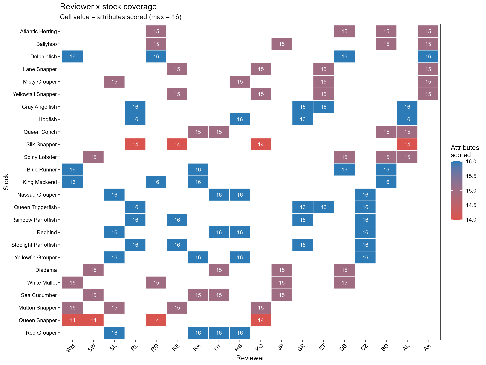

# Script pipeline overview

| Script | Purpose | Reads from | Writes to |
|--------|---------|------------|-----------|
| `1-extract-tally-scores.R` | Extract LMHV tally blocks from all reviewer workbooks | `data/final-scores/*.xlsx` | `outputs/analyses/1-inputs/` |
| `2-finalize-tally-tables.R` | Recode stock names, conform and bind exposure tables, produce long and grouped final tally CSVs | `outputs/analyses/1-inputs/`, `outputs/final-scores-compiled/` | `outputs/final-tallies-long/` |
| `3-plot-figures.R` | Produce all distribution and summary figures; exposure figures filtered to expert-approved factor × stock pairs only | `outputs/final-tallies-long/`, `outputs/final-scores-compiled/`, `data/exposure-factor-filter-long.csv` | `figures/` |

---

# 1-extract-tally-scores.R

## Purpose                                                                                                                         
Reads all reviewer scoring workbooks for the Caribbean CVA and extracts the tally columns from every stock sheet. The output is a set of long-format tally tables that serve as the primary inputs for the bootstrap uncertainty analysis and leave-one-out influence analysis in subsequent scripts. Note that the quantitative exposure factor scores are extracted in [`2-exposure-anomalies/exposure-factor-scores.R`](https://github.com/holden-harris/Caribbean-CVA/tree/main/2-exposure-anomalies) with the workflow described [here](https://github.com/holden-harris/Caribbean-CVA/tree/main/2-exposure-anomalies).

## Directory structure
  ```
  project root/
  ├── data/
  │   └── final-scores/          # Input: one .xlsx workbook per reviewer
  └── outputs/
      └── analyses/
          └── 1-inputs/          # Output: tally tables (CSV)
              ├── qa/            # Output: QA diagnostic tables (CSV)
              └── figures/       # Output: exploratory figures (PNG)
```

## Input files

  | File | Description |
  |------|-------------|
  | `data/final-scores/*.xlsx` | One workbook per reviewer. Each workbook contains one sheet per stock, plus non-stock sheets excluded by the code (`Instructions`, `Data Quality`, `Example`). |

  ### Workbook layout

  | Row(s) | Column(s) | Content |
  |--------|-----------|---------|
  | 17–19  | C         | Qualitative Exposure attribute names |
  | 21–28  | B         | Sensitivity attribute names |
  | 30–35  | B         | Rigidity attribute names (relabelled as Sensitivity) |
  | 38–40  | B         | Directional effect labels (Positive / Neutral / Negative) |
  | 17–35  | K         | Final attribute score |
  | 17–35  | L         | Data quality index |
  | 17–35  | M–P       | Rank tallies: Low (1), Moderate (2), High (3), Very High (4) |
  | 38–40  | M         | Directional effect tally |

  ---

  ## Workflow

  ### Step 1 — Extract tally blocks from all workbooks

  Loops over every reviewer workbook and every stock sheet. For each sheet, calls
  two extraction functions:

  - **`extract_rank_tally_block()`** — reads one block of FINAL SCORE rank tally
    rows. Each tally column (M–P) is read individually via `safe_read_cell()` to
    preserve absolute column alignment; reading a range at once causes
    `readWorkbook()` to silently drop empty columns and shift values left.
    Called three times per sheet: Qualitative Exposure (rows 17–19), Sensitivity
    (rows 21–28), and Rigidity (rows 30–35, relabelled as Sensitivity).

  - **`extract_directional_effect_block()`** — reads the three directional effect
    tally rows (38–40) from column M.

  Results are appended into three running long-format tables:
  `sensitivity_tallies_long`, `qualitative_exposure_tallies_long`, and
  `directional_effect_tallies_long`.

  ### Step 2 — Cleanup

  Applied to all three tables in sequence:

  1. **Drop rows with missing attribute or effect-category names** — removes blank
     rows returned for empty worksheet regions.
  2. **Drop fully empty rows** — removes rows where `final_score`,
     `data_quality_index`, and all four tally bins are all `NA` and `n_tallies`
     equals zero. For directional effect, drops rows where `tally` is `NA`.
  3. **Remove unscored stock × reviewer combinations** — the loop reads every
     sheet in every workbook, including sheets the reviewer did not score.
     Combinations where the sum of `n_tallies` across all rows is zero are
     identified and removed via `anti_join()`.
  4. **Drop redundant columns** — `sheet_name` (identical to `stock_name`) and
     `source_file` (redundant with `reviewer_id`) are removed.
  5. **Shorten `reviewer_id` to initials** — the full workbook filename stem (e.g.
     `Caribbean CVA Scoring Template_2025_AAcosta`) is reduced to the leading
     uppercase letters of the name segment after the final underscore (e.g. `AA`).

  A combined table `all_qualitative_tallies_long` is then built by row-binding the cleaned qualitative exposure and sensitivity tables.

  ### Step 3 — QA checks

  Four diagnostic tables are produced and written to `outputs/analyses/1-inputs/qa/`:

  - **3A Row-level tally checks** — flags rows where `n_tallies ≠ 5`, any tally
    bin is `NA`, or duplicate stock × reviewer × attribute combinations exist.
  - **3B Reviewer × stock coverage matrix** — counts distinct attributes scored
    per reviewer × stock combination; pivoted wide for easy inspection.
  - **3C Attribute-level pooled tally summary** — pools tallies across all
    reviewers for each stock × attribute, calculates a pooled weighted mean score,
    and flags combinations where the pooled tally sum does not equal
    `n_reviewers × 5`.
  - **3D Directional effect summary** — totals directional effect tallies per
    stock across all reviewers.

  ### Step 4 — Write output tables

  Writes the four final tally tables to `outputs/analyses/1-inputs/`.

  ---

  ## QA checks

  | Check | Table | Flag condition |
  |-------|-------|---------------|
  | Row tally sum | `qa_tally_row_checks.csv` | `n_tallies ≠ 5` |
  | NA tally bins | `qa_tally_row_checks.csv` | Any of `tally_L`, `tally_M`, `tally_H`, `tally_VH` is `NA` |
  | Duplicate rows | `qa_tally_row_checks.csv` | More than one row per stock × reviewer × attribute |
  | Pooled tally mismatch | `qa_attribute_tally_summary.csv` | Pooled sum ≠ `n_reviewers × 5` |

  Console messages report counts for all flag conditions after Step 2 cleanup and
  again after Step 3A–3C.

  ---

  ## Output files

  ### Tally tables — `outputs/analyses/1-inputs/`

  | File | Rows | Key columns |
  |------|------|-------------|
  | `table_sensitivity_tallies_long.csv` | One row per reviewer × stock × sensitivity attribute | `stock_name`, `reviewer_id`, `attribute_type`, `attribute_name`, `row_num`, `final_score`, `data_quality_index`, `tally_L`, `tally_M`, `tally_H`, `tally_VH`, `n_tallies` |
  | `table_qualitative_exposure_tallies_long.csv` | One row per reviewer × stock × qualitative exposure attribute | Same columns as above |
  | `table_all_qualitative_tallies_long.csv` | Row-bind of sensitivity and qualitative exposure tables | Same columns as above |
  | `table_directional_effect_tallies_long.csv` | One row per reviewer × stock × effect category | `stock_name`, `reviewer_id`, `effect_category`, `row_num`, `tally`, `n_tallies` |  


  ### QA tables — `outputs/analyses/1-inputs/qa/`

  | File | Contents |
  |------|----------|
  | `qa_tally_row_checks.csv` | Problem rows only: `n_tallies ≠ 5`, NA tally bins |
  | `qa_reviewer_stock_coverage.csv` | Wide matrix: stocks × reviewers, cells = attributes scored |
  | `qa_attribute_tally_summary.csv` | Pooled tallies and weighted mean score per stock × attribute |
  | `qa_directional_effect_summary.csv` | Total tally per stock across all reviewers |

---

# 2-finalize-tally-tables.R

## Purpose
Standardizes stock names, conforms and binds the qualitative and quantitative exposure tally tables, and writes two sets of analysis-ready tally CSVs: reviewer-level long tables and stock-level grouped summary tables. Downstream scripts (`3-plot-figures.R`, `8-uncertainty-analysis/`) read from the output directory rather than the raw `1-inputs/` tables.

## Directory structure
```
project root/
├── outputs/
│   ├── analyses/
│   │   └── 1-inputs/              # Input: raw tally tables from Script 1
│   └── final-scores-compiled/
│       └── quantitative-exposure-attribute-scores-all.csv  # Input: CMIP6 factor scores
└── outputs/
    └── final-tallies-long/        # Output: all six finalized tally tables
```

## Inputs

| File | Description |
|------|-------------|
| `outputs/analyses/1-inputs/table_sensitivity_tallies_long.csv` | Raw reviewer-level sensitivity tallies |
| `outputs/analyses/1-inputs/table_directional_effect_tallies_long.csv` | Raw reviewer-level directional effect tallies |
| `outputs/analyses/1-inputs/table_qualitative_exposure_tallies_long.csv` | Raw reviewer-level qualitative exposure tallies |
| `outputs/final-scores-compiled/quantitative-exposure-attribute-scores-all.csv` | LMHV grid-cell tally counts for 13 CMIP6 factors × 25 stocks × 3 spatial extents |

## Workflow

**Stock name standardization.** A canonical named vector `stock_name_recode` maps legacy lowercase stock names (e.g., `"Atlantic thread herring"`, `"Long-spined sea urchin"`) to title-case canonical names (e.g., `"Atlantic Herring"`, `"Diadema"`). Applied via `recode(stock_name, !!!stock_name_recode)` to all tables on read.

**Exposure tally tables.** The qualitative exposure table is processed two ways: (1) kept at reviewer level for the long table; (2) grouped by `stock_name × attribute_name` with tallies summed across reviewers and `n_scorers` added for the final table. The quantitative exposure table is filtered to `spatial_extent == "U.S. Caribbean"` and conformed to matching columns. Both long and final exposure tables are produced by row-binding the qualitative and quantitative conform steps. `Coral cover` rows are excluded from qualitative exposure in both tables.

## Output files — `outputs/final-tallies-long/`

### Set 1 — Reviewer-level long tables

| File | Rows | Key columns |
|------|------|-------------|
| `sensitivity_tallies_long.csv` | One row per reviewer × stock × attribute | `reviewer_id`, `stock_name`, `attribute_name`, `tally_L`, `tally_M`, `tally_H`, `tally_VH`, `n_tallies` |
| `directional_effect_tallies_long.csv` | One row per reviewer × stock × effect category | `reviewer_id`, `stock_name`, `effect_category`, `tally` |
| `exposure_tallies_long.csv` | One row per reviewer × stock × exposure attribute (qual) or stock × factor (quant) | `reviewer_id` (NA for quant rows), `stock_name`, `attribute_type`, `attribute_name`, `tally_L`, `tally_M`, `tally_H`, `tally_VH`, `n_tallies` |

### Set 2 — Grouped summary tables (one row per stock × grouping variable)

| File | Rows | Key columns |
|------|------|-------------|
| `sensitivity_tallies_by_stock.csv` | One row per stock × attribute | `stock_name`, `attribute_name`, `tally_L`, `tally_M`, `tally_H`, `tally_VH`, `n_tallies`, `n_scorers` |
| `directional_effect_tallies_by_stock.csv` | One row per stock | `stock_name`, `tally_neg`, `tally_neut`, `tally_pos`, `n_tallies`, `n_scorers` |
| `exposure_tallies_by_stock.csv` | One row per stock × attribute (qual grouped + quant) | `stock_name`, `attribute_type`, `attribute_name`, `tally_L`, `tally_M`, `tally_H`, `tally_VH`, `n_tallies`, `n_scorers` (NA for quant rows) |

---

# 3-plot-figures.R

## Purpose
Produces all primary distribution and summary figures for the Caribbean CVA. Reads finalized tally tables from `outputs/final-tallies-long/` (produced by `2-finalize-tally-tables.R`) and per-stock attribute mean scores from `outputs/final-scores-compiled/`. Visualizes the spread of reviewer-assigned vulnerability scores and LMHV tally distributions across the 25 assessed stocks, for both biological sensitivity attributes and exposure factors (qualitative + quantitative).

## Directory structure
```
project root/
├── outputs/
│   ├── analyses/
│   │   └── 1-inputs/              # Input: table_all_qualitative_tallies_long.csv (QA figure only)
│   ├── final-tallies-long/        # Input: finalized tally tables from Script 2
│   └── final-scores-compiled/
│       └── overall-vulnerability-rankings/
│           └── attribute_means_uscar.csv   # Input: per-stock attribute mean scores
└── figures/                       # Output: all PNG figures
```

## Inputs

| File | Description |
|------|-------------|
| `outputs/final-tallies-long/sensitivity_tallies_long.csv` | Reviewer-level sensitivity tallies, stock names standardized |
| `outputs/final-tallies-long/directional_effect_tallies_long.csv` | Reviewer-level directional effect tallies, stock names standardized |
| `outputs/final-tallies-long/exposure_tallies_long.csv` | Combined qual + quant exposure tally table, stock names standardized; contains all factor × stock combinations (complete reference) |
| `outputs/analyses/1-inputs/table_all_qualitative_tallies_long.csv` | Used only for the QA reviewer × stock coverage heatmap |
| `outputs/final-scores-compiled/overall-vulnerability-rankings/attribute_means_uscar.csv` | Per-stock × attribute mean scores (U.S. Caribbean); `attribute_type` ∈ `"Sensitivity"`, `"Exposure"`; contains all factor × stock combinations (complete reference) |
| `data/exposure-factor-filter-long.csv` | Expert rubric filter: one row per stock × exposure factor with `include` (TRUE/FALSE). Generated by `4-final-attribute-exposure-scoring/3-calculate-overall-vulnerability-scores.R`. Applied to Figures 1B and 3B to restrict exposure data to the expert-approved subset per stock. |

### Data carpentry

**Short display labels.** Two named lookup vectors (`attr_short_names`, `exp_attr_short_names`) map full attribute names to abbreviated display labels (≤ 16 characters) used on all figure y-axes. Defined once in the data prep section and referenced by all figures.

**Directional effect summary.** `qa_dir_summary` is derived by grouping `directional_effect_tallies_long` by `stock_name × effect_category` and summing `tally` across reviewers. Used by Figure 2.

**Expert exposure factor filter.** `data/exposure-factor-filter-long.csv` is read and normalized (stock names converted to Title Case to match `exposure_tallies_long` and `attr_means`) into `exp_filter_approved`. This lookup — derived from `data/attribute-list-rubric-completed.csv` in consultation with Caribbean CVA reviewers — identifies which exposure factors are scientifically relevant for each stock. Not all 15 factors are relevant for every stock: for example, both sea surface temperature and bottom temperature were retained only for stocks that occupy both pelagic and demersal habitats. Figures 1B and 3B are filtered via `semi_join` to this approved subset before plotting; `exposure_tallies_long.csv` and `attribute_means_uscar.csv` themselves remain complete and unfiltered.

**Exposure pooled summaries.** `exp_pooled_stock` is derived from `exposure_tallies_long` after applying the expert filter, retaining only approved factor × stock pairs. `exp_pooled` is then computed as a summary of `exp_pooled_stock` (pooled across stocks) to derive y-axis ordering by mean score. Tally units differ by `attribute_type` — qualitative tallies count reviewer votes; quantitative tallies count LMHV grid cells — but both are expressed as proportions and are visually comparable.

## Output Figures — `figures/`

| File | Figure | Description |
|------|--------|-------------|
| `fig_sensitivity_attribute_score_boxplot.png` | 1A | Sensitivity attribute score distributions (boxplot) |
| `fig_exposure_attribute_score_boxplot.png` | 1B | Exposure factor score distributions (boxplot) |
| `fig_attribute_score_boxplot_combined.png` | 1 (combined) | Panels 1A and 1B side by side |
| `fig_directional_effect_summary.png` | 2 | Directional effect proportions by stock |
| `fig_sensitivity_tally_distributions_by_stock.png` | 3A | Per-stock sensitivity LMHV tally distributions |
| `fig_exposure_tally_distributions_by_stock.png` | 3B | Per-stock exposure LMHV tally distributions |
| `fig_reviewer_stock_coverage.png` | QA | Reviewer × stock attribute coverage heatmap |

---

### Figure 1 — Score distributions (combined panel)

Two horizontal boxplot figures are produced and then combined into a single two-panel figure.

**Figure 1A — Biological sensitivity attributes** (`fig_sensitivity_attribute_score_boxplot.png`):
- One box per sensitivity attribute (14 attributes), ordered by median score ascending (bottom to top).
- x-axis: mean score across stocks (1 = Low, 4 = Very High); data from `attr_means` filtered to `attribute_type == "Sensitivity"`.
- Fill color: each box is filled by its attribute median score, mapped through the LMHV gradient (`green3` → `yellow2` → `orange2` → `red3`, anchored at 1–4).

**Figure 1B — Exposure factors** (`fig_exposure_attribute_score_boxplot.png`):
- Same structure as Figure 1A, filtered to `attribute_type == "Exposure"` (up to 15 attributes).
- Attributes cover both qualitative (expert-scored) and quantitative (CMIP6-derived) factors; both use the 1–4 LMHV scale.
- Each factor's boxplot spans only the stocks for which that factor was expert-approved (via `exp_filter_approved`). Stocks for which a factor was deemed irrelevant by the CVA reviewers are excluded from that factor's distribution. For example, Bottom temperature includes only the demersal and reef-associated stocks identified in the rubric, not all 25 stocks.

**Combined panel** (`fig_attribute_score_boxplot_combined.png`):
- Figure 1A (panel A) and Figure 1B (panel B) placed side by side.
- Panel tags added via `plot_annotation(tag_levels = "A")`.

[`fig_attribute_score_boxplot_combined.png`](https://github.com/holden-harris/Caribbean-CVA/blob/main/figures/fig_attribute_score_boxplot_combined.png)


---

### Figure 2 — Directional effect summary by stock

[`fig_directional_effect_summary.png`](https://github.com/holden-harris/Caribbean-CVA/blob/main/figures/fig_directional_effect_summary.png)

Horizontal stacked bar chart showing the proportion of reviewer tallies classified as Positive, Neutral, or Negative for each stock. Stocks are ordered by proportion Negative (ascending). Colors: Positive = `blue`, Neutral = `bisque`, Negative = `indianred4`. Data source: `directional_effect_tallies_long`, pooled across all reviewers per stock.


---

### Figure 3A — Sensitivity tally distributions by stock

[`fig_sensitivity_tally_distributions_by_stock.png`](https://github.com/holden-harris/Caribbean-CVA/blob/main/figures/fig_sensitivity_tally_distributions_by_stock.png)

Faceted 5 × 5 panel figure (one panel per stock). Each panel shows one horizontal stacked bar per sensitivity attribute, ordered by pooled mean score ascending. Bar segments show the proportion of reviewer tallies in each LMHV category (Low / Moderate / High / Very High). Y-axis labels use abbreviated names from `attr_short_names`. Colors: Low = `green3`, Moderate = `yellow2`, High = `orange2`, Very High = `red3`. Saved at 8.5" × 11", 900 dpi.


---

### Figure 3B — Exposure tally distributions by stock

[`fig_exposure_tally_distributions_by_stock.png`](https://github.com/holden-harris/Caribbean-CVA/blob/main/figures/fig_exposure_tally_distributions_by_stock.png)

Same structure as Figure 3A. Each stock facet shows only the exposure factors that were expert-approved for that stock (via `exp_filter_approved`); factors excluded by the CVA reviewers for a given stock have no bar in that panel. The y-axis listing and ordering therefore varies by stock, reflecting the approved subset rather than a fixed set of 15 factors. Y-axis ordering is determined by pooled mean score across all approved factor × stock pairs (ascending). Tally units differ by attribute type — qualitative tallies count reviewer votes; quantitative tallies count LMHV grid cells — but both are expressed as proportions and are visually comparable. Y-axis labels use abbreviated names from `exp_attr_short_names`. Saved at 8.5" × 11", 900 dpi.


---

### Figure QA — Reviewer × stock coverage heatmap

[`fig_reviewer_stock_coverage.png`](https://github.com/holden-harris/Caribbean-CVA/blob/main/figures/fig_reviewer_stock_coverage.png)

Tile heatmap with reviewers on x and stocks on y. Each cell is colored by the count of attributes scored (red = few, blue = full coverage) with the count printed in white. Used to identify reviewer × stock combinations with missing or incomplete assessments.



---
