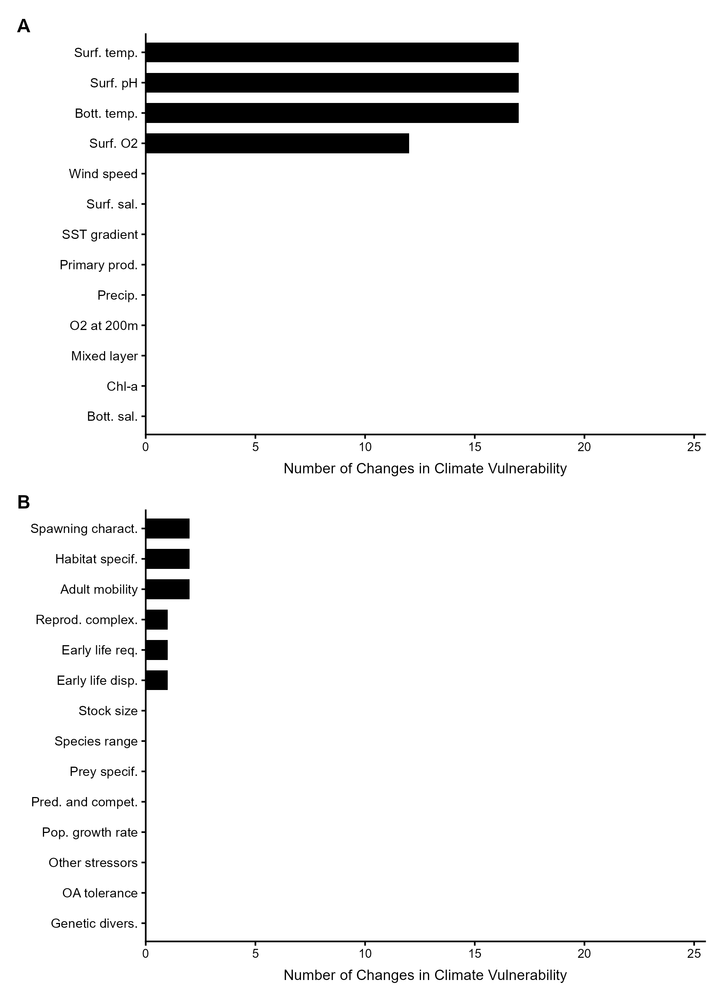
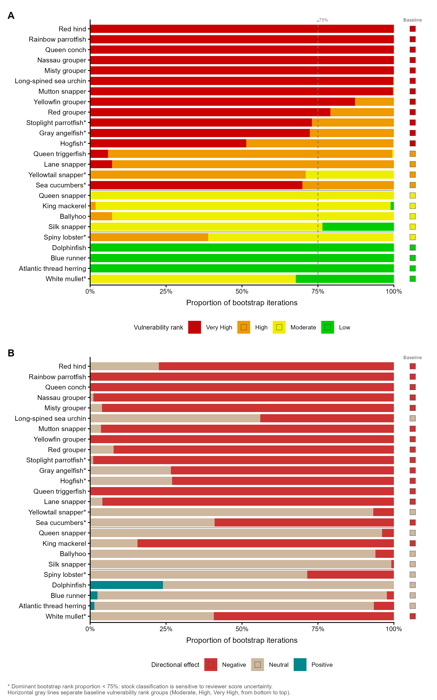

# 8-uncertainty-analysis

## Pipeline overview

| Script | Purpose | Reads from | Writes to |
|--------|---------|------------|-----------|
| `uncertainty-analyses.R` | Run bootstrap resampling and leave-one-out influence analyses; validate baseline score reproduction | `outputs/final-tallies-long/`, `outputs/final-scores-compiled/` | `outputs/analyses/uncertainty-loo/` |
| `2-make-uncertainty-figures.R` | Produce LOO influence bar chart and bootstrap uncertainty stacked bar chart | `outputs/analyses/uncertainty-loo/final-tables/`, `outputs/final-scores-compiled/` | `figures/` |

---

## Purpose

This folder contains the scripts that quantify and visualize the **statistical robustness** of the Caribbean CVA final vulnerability rankings. Two complementary analyses are conducted:

1. **Bootstrap resampling** — estimates how sensitive each stock's vulnerability rank is to the random variation inherent in expert reviewer tally scoring (i.e., "if we redrew from the pool of reviewer votes, how often would we arrive at the same rank?").
2. **Leave-one-out (LOO) influence analysis** — determines which sensitivity attributes and exposure factors most control the final rank by measuring how many stocks change rank when that attribute or factor is omitted.

Both analyses follow the methods of [Loughran et al. (2025)](https://doi.org/10.1371/journal.pclm.0000530) for the NOAA HMS CVA.

---

## Methods context

### Bootstrap resampling

The bootstrap uses the **tally draw-pile method** from the HMS CVA. For each stock × sensitivity attribute combination, all reviewer tally votes are pooled into a single draw pile (4 reviewers × 5 tallies = **20 votes** per attribute). Each vote is coded numerically (1 = Low, 2 = Moderate, 3 = High, 4 = Very High). The pile is sampled with replacement 20 times, and the mean of the sample is the bootstrapped attribute mean for that iteration. This is repeated for all 14 sensitivity attributes and 10,000 bootstrap iterations per stock.

> **Why 20 votes?** The Caribbean CVA had 4 reviewers each distributing 5 tallies per attribute, matching the HMS CVA structure (which used 5 reviewers × 5 = 25 tallies). This script uses 20 tallies accordingly.

The bootstrapped attribute means are passed into the FCVA logic model to produce a bootstrapped Sensitivity component rank. The Exposure component score is **held fixed** at the finalized baseline value for each stock, because Caribbean CVA exposure scores are derived from quantitative CMIP6 data (not reviewer tallies) and therefore have no tally-level uncertainty to resample.

The bootstrapped Sensitivity score is then multiplied by the fixed Exposure score to produce a bootstrapped vulnerability score, which is assigned a rank. After 10,000 iterations, each stock has a distribution of vulnerability ranks, from which the proportion of iterations in each rank is reported. A stock is flagged as **borderline** if its dominant (most frequent) rank accounts for fewer than 75% of iterations.

**Directional effects** are bootstrapped using the same draw-pile approach applied to Positive / Neutral / Negative reviewer votes (4 reviewers × 4 aspects = **16 votes** per stock, coded +1 / 0 / −1). The bootstrap weighted mean is:

> w_mean = mean(sample) = (n_positive − n_negative) / 16,  range [−1, +1]

Classification thresholds (matching the HMS CVA): ≥ +0.33 = Positive, ≤ −0.33 = Negative, otherwise Neutral.

### Leave-one-out analysis

The LOO analysis is **deterministic** — no randomness. For each stock × attribute (sensitivity) or stock × factor (exposure) combination, the attribute or factor is removed from the set of compiled means, the FCVA logic model is re-run on the remaining attributes or factors, the other component score is held fixed, and the new vulnerability rank is compared to the baseline. The count of stocks that change rank when a given attribute or factor is omitted is the measure of that attribute's or factor's influence on the final rankings.

### FCVA logic model

Both analyses use the same logic model implemented as `fcva_logic_model()`. The sensitivity (or exposure) component rank is assigned based on how many attribute means meet each threshold:

| Component rank | Threshold |
|---------------|-----------|
| Very High | More than 3 attribute means ≥ 3.5 |
| High | More than 2 attribute means ≥ 3.0 |
| Moderate | More than 2 attribute means ≥ 2.5 |
| Low | All other |

The final vulnerability score = Sensitivity score × Exposure score. Possible values and their ranks:

| Score | Vulnerability rank |
|-------|-------------------|
| 1–3 | Low |
| 4–6 | Moderate |
| 8–9 | High |
| 12–16 | Very High |

These thresholds are validated against the finalized Caribbean CVA baseline scores during Step 3 of `uncertainty-analyses.R` before any analysis is run.

### Stock name normalization

Tally input files (`final-tallies-long/`) use Title Case stock names as entered by reviewers. The compiled baseline files use sentence case. Four stocks also have substantively different common names between the two sources. Both issues are corrected by a two-step normalization applied in `uncertainty-analyses.R`:

1. **Manual overrides** (applied first):

| Tally file name | Baseline file name | Reason |
|----------------|--------------------|--------|
| `Atlantic Herring` | `Atlantic thread herring` | Different common name |
| `Diadema` | `Long-spined sea urchin` | Different common name |
| `Redhind` | `Red hind` | Missing space |
| `Sea Cucumber` | `Sea cucumbers` | Singular vs. plural |

2. **`stringr::str_to_sentence()`** — converts the remaining 21 Title Case names to sentence case, matching the baseline convention.

---

## Directory structure

```
8-uncertainty-analysis/
├── uncertainty-analyses.R          # Script 1: bootstrap + LOO analyses
├── 2-make-uncertainty-figures.R    # Script 2: figures
└── ReadMe.MD                       # This file

outputs/analyses/uncertainty-loo/   # All analysis outputs (created by Script 1)
├── intermediate/                   # Validation and QA tables
│   ├── 01_preanalysis_check_log.csv
│   └── 02_baseline_reproduced_scores.csv
└── final-tables/                   # Analysis outputs used for figures
    ├── table_bootstrap_uncertainty_stock.csv
    ├── table_bootstrap_uncertainty_sensitivity_component.csv
    ├── table_directional_effect_bootstrap.csv
    ├── table_leave_one_out_sensitivity_long.csv
    ├── table_leave_one_out_sensitivity_summary.csv
    ├── table_leave_one_out_exposure_long.csv
    ├── table_leave_one_out_exposure_summary.csv
    ├── table_sensitivity_attribute_scores_for_plot.csv
    └── table_exposure_factor_scores_for_plot.csv

figures/                            # Figures produced by Script 2
├── fig_loo_bar_plots.png
└── fig_bootstrap_uncertainty.png
```

---

# `uncertainty-analyses.R`

## Purpose

Reads the finalized Caribbean CVA tally inputs and compiled attribute means, then runs three analyses in sequence: (1) a baseline score reproduction check to confirm the logic model matches the main scoring script, (2) bootstrap resampling to quantify vulnerability rank uncertainty, and (3) leave-one-out analysis to identify the most influential attributes and factors.

## Analysis settings

| Setting | Value | Description |
|---------|-------|-------------|
| `n_boot` | 10,000 | Number of bootstrap iterations per stock |
| `bootstrap_seed` | 99 | Random seed set once before each bootstrap loop |
| `dir_eff_threshold` | 0.33 | ±0.33 directional rank cutoff (matching HMS CVA) |
| `borderline_threshold` | 0.25 | Stocks flagged borderline when dominant rank prop < 0.75 |

## Helper functions

Three functions are defined at the top of the script and called in multiple steps. All other logic is written inline.

| Function | Arguments | Returns | Called in |
|----------|-----------|---------|-----------|
| `fcva_logic_model(mean_scores)` | Numeric vector of attribute mean scores (1–4) | 1-row tibble: `component_rank` (character), `component_score_numeric` (integer) | Steps 3, 4, 6, 7 |
| `assign_vulnerability_rank(v)` | Numeric vulnerability score (sens × exp product) | Character rank label (Low / Moderate / High / Very High / NA) | Steps 3, 4, 6, 7 |
| `assign_directional_rank(w_mean, threshold)` | Directional weighted mean [−1, +1]; threshold (default 0.33) | Character rank label (Negative / Neutral / Positive) | Steps 1, 5 |

## Input files

| File | Description | Used in |
|------|-------------|---------|
| `outputs/final-tallies-long/sensitivity_tallies_long.csv` | Per-reviewer × stock × attribute tally counts (`tally_L`, `tally_M`, `tally_H`, `tally_VH`, `n_tallies`); one row per reviewer × stock × attribute | Steps 1, 2, 4 |
| `outputs/final-tallies-long/directional_effect_tallies_long.csv` | Per-reviewer × stock × effect category tally counts; one row per reviewer × stock × category | Steps 1, 2, 5 |
| `outputs/final-scores-compiled/overall-vulnerability-rankings/attribute_means_uscar.csv` | Compiled mean scores per stock × attribute for both Sensitivity and Exposure; filtered by `attribute_type` and `score_type` in Step 1 | Steps 1, 3, 6, 7, 8 |
| `outputs/final-scores-compiled/overall-vulnerability-rankings/overall_vulnerability_scores_uscar.csv` | Finalized baseline vulnerability scores and ranks for all 25 stocks | Steps 1, 3, 4, 6, 7 |

## Workflow

### Step 1 — Read and standardize inputs

Reads all four input files and applies the stock name normalization described above. The tally files receive both the manual override recode and `str_to_sentence()`. Columns are renamed or cast for consistency.

Sensitivity tallies are filtered to `attribute_type == "Sensitivity"` (which includes both qualitative Sensitivity attributes and Rigidity attributes — both feed the Sensitivity component). Tallies are then aggregated across all reviewers per stock × attribute to produce `sens_tallies_agg`, the draw pile totals used in the bootstrap.

Directional tallies are aggregated and pivoted to wide format (one row per stock, columns: Positive, Neutral, Negative). The baseline directional weighted mean and rank are computed here.

Attribute means are split into `sens_means_std` (14 qualitative Sensitivity attributes, filtered by `attribute_type == "Sensitivity"` and `score_type == "Qualitative"`) and `exp_means_std` (13 quantitative Exposure factors, filtered by `attribute_type == "Exposure"` and `score_type == "Calculated"`).

### Step 2 — Pre-analysis checks

Four checks are run and written to `01_preanalysis_check_log.csv`. The script halts on any `FAIL`; `WARN` is informational only.

| Check | Pass condition | Status on failure |
|-------|---------------|-----------------|
| `sensitivity_tally_row_sums` | Every reviewer row: `tally_L + tally_M + tally_H + tally_VH == n_tallies` | FAIL (hard stop) |
| `directional_tally_reviewer_sums` | Every reviewer × stock: sum of directional tallies == 4 | WARN |
| `tally_stocks_missing_in_baseline` | No stocks present in tallies but absent from baseline | WARN |
| `baseline_stocks_missing_in_tallies` | No stocks present in baseline but absent from tallies | WARN |

### Step 3 — Baseline reproduction (validation gate)

`fcva_logic_model()` is applied to the compiled sensitivity attribute means and the compiled exposure factor means for each stock, reproducing the Sensitivity rank, Exposure rank, and Vulnerability rank from first principles. The reproduced ranks are compared to the finalized baseline in `overall_vulnerability_scores_uscar.csv`. If any stock's reproduced rank does not match, the script stops with an error message listing the mismatched stocks.

This gate ensures the logic model thresholds in this script are exactly consistent with those used in the main Caribbean CVA scoring scripts before any uncertainty analyses are run. Reproduced scores are written to `02_baseline_reproduced_scores.csv` for inspection.

### Step 4 — Bootstrap: Sensitivity component and Vulnerability uncertainty

For each of the 25 stocks:

1. **Build draw piles** once outside the bootstrap loop. For each of the 14 sensitivity attributes, construct an integer vector of length 20 (`total_L` copies of 1, `total_M` copies of 2, `total_H` copies of 3, `total_VH` copies of 4). This is the pool of all 20 reviewer tally votes for that stock × attribute combination.

2. **Loop 10,000 times:**
   - For each attribute, draw 20 values with replacement from its draw pile. The mean of the 20 draws is the bootstrapped attribute mean.
   - Pass all 14 bootstrapped attribute means to `fcva_logic_model()` → bootstrapped Sensitivity score and rank.
   - Multiply by the fixed baseline Exposure score → bootstrapped Vulnerability score → rank via `assign_vulnerability_rank()`.
   - Store the bootstrapped Sensitivity rank and Vulnerability rank for this iteration.

3. **Summarize** the 10,000 rank outcomes: count and proportion in each rank. A stock is flagged `borderline = TRUE` when the dominant rank proportion is below the `1 − borderline_threshold` cutoff (i.e., < 0.75).

Both the per-stock vulnerability rank distribution and the sensitivity component rank distribution are written to separate output tables.

### Step 5 — Bootstrap: Directional effects uncertainty

Same draw-pile approach applied to directional votes. The draw pile for each stock is a 16-element vector: `rep(+1, Positive)`, `rep(0, Neutral)`, `rep(-1, Negative)`. Each bootstrap iteration resamples 16 votes, computes the weighted mean, and classifies the result using `assign_directional_rank()` with the ±0.33 threshold. Results are summarized as proportion of iterations in each directional category (Negative / Neutral / Positive), with the baseline directional rank and weighted mean attached for comparison.

### Step 6 — Leave-one-out: Sensitivity attributes

For each stock × sensitivity attribute combination (25 stocks × 14 attributes = **350 combinations**):

1. Remove that attribute's mean from the set of 14 compiled means.
2. Re-run `fcva_logic_model()` on the remaining 13 means → new Sensitivity rank.
3. Multiply by the fixed baseline Exposure score → new Vulnerability score and rank.
4. Record whether the Vulnerability rank changed and in which direction (Higher / Lower / No change).

A summary table counts how many stocks changed rank for each attribute (across all 25 stocks). Attributes are sorted by descending number of rank changes — the most influential attributes appear first.

### Step 7 — Leave-one-out: Exposure factors

Same structure as Step 6 but for exposure factors (25 stocks × 13 factors = **325 combinations**):

1. Remove one exposure factor mean at a time from the set of 13 compiled means.
2. Re-run `fcva_logic_model()` on the remaining 12 means → new Exposure rank.
3. Multiply by the fixed baseline Sensitivity score → new Vulnerability score and rank.
4. Record rank change and direction.

### Step 8 — Save figure-ready tables

Joins each stock's per-attribute mean scores (sensitivity and exposure) with that stock's baseline component rank. These tables are used by downstream scripts to produce score distribution figures.

## Output files

### Intermediate (validation and QA) — `outputs/analyses/uncertainty-loo/intermediate/`

| File | Rows | Contents |
|------|------|----------|
| `01_preanalysis_check_log.csv` | 4 | One row per check; columns: `check_name`, `status` (PASS / FAIL / WARN), `detail` |
| `02_baseline_reproduced_scores.csv` | 25 | Reproduced Sensitivity, Exposure, and Vulnerability scores for all stocks; used to confirm the validation gate passed |

### Final analysis tables — `outputs/analyses/uncertainty-loo/final-tables/`

| File | Rows | Key columns |
|------|------|-------------|
| `table_bootstrap_uncertainty_stock.csv` | 100 (25 stocks × 4 ranks) | `stock_name`, `vuln_rank`, `n`, `prop`, `borderline` |
| `table_bootstrap_uncertainty_sensitivity_component.csv` | 100 (25 stocks × 4 ranks) | `stock_name`, `sens_rank`, `n`, `prop` |
| `table_directional_effect_bootstrap.csv` | 75 (25 stocks × 3 categories) | `stock_name`, `dir_rank`, `n`, `prop`, `baseline_dir_rank`, `baseline_w_mean` |
| `table_leave_one_out_sensitivity_long.csv` | 350 (25 × 14) | `stock_name`, `attribute_omitted`, `baseline_sens_rank`, `new_sens_rank`, `baseline_vuln_rank`, `new_vuln_rank`, `baseline_vuln_score`, `new_vuln_score`, `rank_changed`, `rank_change_direction` |
| `table_leave_one_out_sensitivity_summary.csv` | 14 | `attribute_omitted`, `n_stocks_tested`, `n_rank_changed`, `n_rank_lower`, `n_rank_higher`, `prop_rank_changed` |
| `table_leave_one_out_exposure_long.csv` | 325 (25 × 13) | `stock_name`, `factor_omitted`, `baseline_exp_rank`, `new_exp_rank`, `baseline_vuln_rank`, `new_vuln_rank`, `baseline_vuln_score`, `new_vuln_score`, `rank_changed`, `rank_change_direction` |
| `table_leave_one_out_exposure_summary.csv` | 13 | `factor_omitted`, `n_stocks_tested`, `n_rank_changed`, `n_rank_lower`, `n_rank_higher`, `prop_rank_changed` |
| `table_sensitivity_attribute_scores_for_plot.csv` | 350 | `stock_name`, `attribute_name`, `mean_score`, `component_rank_baseline` |
| `table_exposure_factor_scores_for_plot.csv` | 325 | `stock_name`, `exposure_factor`, `mean_score`, `component_rank_baseline` |

---

# `2-make-uncertainty-figures.R`

## Purpose

Reads the LOO summary tables and bootstrap output tables produced by `uncertainty-analyses.R` and produces two publication-ready figures. All panels use `theme_classic()` and the same LMHV color palette (`green3` / `yellow2` / `orange2` / `red3`) established in `7-scoring-distributions/3-plot-figures.R`.

## Input files

| File | Used by |
|------|---------|
| `outputs/analyses/uncertainty-loo/final-tables/table_leave_one_out_exposure_summary.csv` | Figure 1, Panel A |
| `outputs/analyses/uncertainty-loo/final-tables/table_leave_one_out_sensitivity_summary.csv` | Figure 1, Panel B |
| `outputs/analyses/uncertainty-loo/final-tables/table_bootstrap_uncertainty_stock.csv` | Figure 2, Panel A |
| `outputs/analyses/uncertainty-loo/final-tables/table_directional_effect_bootstrap.csv` | Figure 2, Panel B |
| `outputs/final-scores-compiled/overall-vulnerability-rankings/overall_vulnerability_scores_uscar.csv` | Figure 2 (stock ordering) |

## Output figures — `figures/`

---

### Figure 1 — LOO influence bar plots (`fig_loo_bar_plots.png`)

[`fig_loo_bar_plots.png`](https://github.com/holden-harris/Caribbean-CVA/blob/main/figures/fig_loo_bar_plots.png)

A two-panel horizontal bar chart. Each bar represents one exposure factor (Panel A) or one sensitivity attribute (Panel B). Bar length = the number of stocks (out of 25) that changed their final vulnerability rank when that factor or attribute was omitted from the LOO analysis. Bars are ordered by influence, with the most influential variable at the top of each panel. Y-axis labels use abbreviated display names defined in the script (consistent with `7-scoring-distributions/3-plot-figures.R`). Both panels share the same x-axis scale (0–25).



**Key results visible in this figure:**
- Four exposure factors drive rank changes in all 25 stocks: surface temperature, surface pH, sea surface oxygen, and bottom temperature. These dominate the exposure component score.
- The remaining 9 exposure factors produce zero rank changes — they score consistently below the threshold that drives rank transitions.
- For sensitivity, spawning characteristics, habitat specificity, and adult mobility are the most influential attributes (2–3 stocks each). Most sensitivity attributes produce zero changes, indicating the sensitivity rankings are robust.

---

### Figure 2 — Bootstrap uncertainty (`fig_bootstrap_uncertainty.png`)

[`fig_bootstrap_uncertainty.png`](https://github.com/holden-harris/Caribbean-CVA/blob/main/figures/fig_bootstrap_uncertainty.png)

A two-panel horizontal stacked bar chart. Each horizontal bar = one stock. Bars are ordered identically in both panels — primary sort by baseline vulnerability rank (Very High at top, Moderate at bottom), secondary sort within each rank group by dominant bootstrap proportion ascending, so the most uncertain stocks sit near each rank-group boundary. Stocks whose dominant bootstrap rank proportion falls below 75% are marked with an asterisk (`*`). Thin horizontal gray lines separate the three baseline rank groups (Moderate, High, Very High).

**Panel A — Vulnerability rank bootstrap:**
- Bar segments colored by vulnerability rank (Low = `green3`, Moderate = `yellow2`, High = `orange2`, Very High = `red3`).
- Stacking order: Low → Moderate → High → Very High (left to right), so warm colors accumulate rightward.
- A dashed vertical line at 75% marks the borderline threshold.
- Small colored squares to the right of each bar show the finalized **baseline** vulnerability rank for that stock, drawn from the same color scale. This allows direct comparison of the bootstrap distribution (bar) with the official final result (square).

**Panel B — Directional effect bootstrap:**
- Same stock ordering as Panel A for row-for-row comparison.
- Bar segments colored by directional effect: Negative = `#D55E00` (Okabe-Ito vermillion), Neutral = `gray75`, Positive = `#0072B2` (Okabe-Ito blue).
- Negative is anchored at x = 0 (leftmost) so the dominant negative signal is directly readable as bar length.
- Small baseline directional rank squares on the right, using the same directional color scale.



**Key results visible in this figure:**
- Very High stocks (top group) are classified with high confidence: Nassau grouper, Misty grouper, and Rainbow parrotfish each show 99–100% of iterations in Very High.
- Six stocks are borderline (`*`): King mackerel and Queen conch in the Moderate group; Silk snapper, White mullet, and Yellowtail snapper near the Moderate/High boundary; Yellowfin grouper at the High/Very High boundary.
- King mackerel is the most notable borderline case: its finalized baseline rank is Moderate (yellow square), but 60% of bootstrap iterations classify it as High (orange bar) — the finalized score sits just below the High threshold.
- Panel B shows strong negative directional consensus for most stocks in the High and Very High groups (near-solid vermillion bars), while lower-vulnerability Moderate stocks tend toward Neutral. Dolphinfish is the only stock with a visible Positive segment, reflecting its baseline directional weighted mean of +0.25 (the closest of any stock to the +0.33 Positive threshold).
