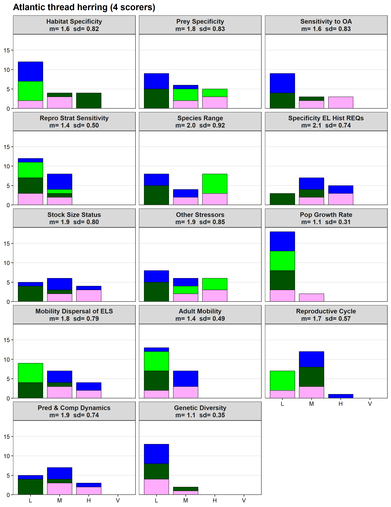

# 1-extract-scores.R —— Builds the master scoring table for the Caribbean CVA pre-work

**Purpose.** This script reads each reviewer’s Excel workbook and compiles the sensitivity/rigidity attribute tallies into a single, machine-readable table (`score_table_all`). Reviewers score each **stock** (species) on 14 attributes by allocating 5 tallies across four bins (L/M/H/V). We pull the per-stock, per-attribute tallies from rows **21–35** (skipping row **29**) and columns **B, E–I** on each stock tab.

---

## Inputs & conventions

- **Folder of reviewer workbooks:** `./data/preliminary-scores/`
  - Filenames follow: `Caribbean CVA Scoring Template_2025_<Scorer>.xlsx`
  - The **scorer** name is parsed from the filename (text after the last underscore).
- **Tabs to ignore:** `Instructions`, `Data Quality`, `Example`.
- **Attributes are tagged** into two canonical groups for QA and consistency:
  - **Sensitivity (8):** *Habitat specificity, Prey specificity, Tolerance to ocean acidification, Complexity in reproductive strategy, Species range, Specificity in early life history requirements, Stock size/status, Other stressors.*
  - **Rigidity (6):** *Population growth rate, Mobility and dispersal or early life stages, Adult mobility, Spawning characteristics, Predation and competition dynamics, Genetic diversity.*

> ⚠️ **Important:** On Windows **do not** keep a workbook open in Excel while running this script. Excel can lock the file, causing read failures.

---

## What the script produces

- **`score_table_all`** — one row per *Scorer × stock_name × attribute* with:
  - `SourceFile, Scorer, stock_name, row_idx`
  - `Attribute_name, Attribute_type`
  - `Data_quality`
  - `Scoring_rank_1, Scoring_rank_2, Scoring_rank_3, Scoring_rank_4`
- **QA summaries** printed to console:
  - Scorers × number of stocks scored
  - Counts of unique scorers, stocks, attributes (target ≈ **16 scorers**, **25 stocks**, **14 attributes**)
  - Per-stock coverage: number of scorers and attributes
- **CSV output:** `./data/preliminary-scores/score_table_all.csv`

---

## How it works (step-by-step)

1. **Load packages** quietly (`readxl`, `xml2`, `dplyr`, `stringr`, `tidyr`, `tibble`).
2. **Configure** input directory and the list of admin tabs to ignore.
3. **Define attribute sets** for tagging each row as **Sensitivity** or **Rigidity**.
4. **Helper: `parse_scorer(path)`**  
   Extracts the scorer’s ID from the workbook filename (text after the last underscore, before the extension).
5. **Helper: `safe_visible_sheet_names(xlsx_path)`**  
   Uses `openxlsx` (if available) to read **only visible** sheets; otherwise falls back to `readxl::excel_sheets()`.
6. **Helper: `extract_tab_rows(xlsx_path, tab, Scorer)`**  
From each stock tab, the script reads:
   - **Column B (rows 21–35)** → `Attribute_name`
   - **Column E** → `Data_quality`
   - **Columns F–I** → `Scoring_rank_1` (L), `Scoring_rank_2` (M), `Scoring_rank_3` (H), `Scoring_rank_4` (V)
   - **Row 29** is intentionally skipped
8. **Helper: `build_score_table_for_workbook(xlsx_path)`**  
   - **Copies the file to a temp path** to avoid Windows/OneDrive file-locks.  
   - Gets visible, non-admin tabs.  
   - Binds the `extract_tab_rows()` results for all stock tabs in that workbook.  
   - Wrapped in `tryCatch` so a bad file won’t stop the whole run (errors are logged and the file is skipped).
9. **Compile loop**  
   - Lists all `xl*` files in `./data/preliminary-scores/` (xlsx/xls/xlsm, etc.).  
   - Logs each file, builds its table with `build_score_table_for_workbook()`, and row-binds all outputs.  
   - Sorts by `Scorer, stock_name, row_idx`.
10. **Remove hidden/empty rows**  
   - After binding, filters out rows where **all five** fields are `NA`: `Data_quality` and `Scoring_rank_1..4`.
11. **QA**  
    - Counts scorers, stocks, attributes and prints per-stock coverage.  
    - Optional: compare found vs expected scorers using filenames.  
12. **Write CSV** for downstream plotting/analysis.

### Common pitfalls & remedies

- **Excel file is open** → file can’t be read; close Excel and re-run.
- **OneDrive “cloud-only” files** → mark folder as *Always keep on this device*.
- **Hidden tabs** → ignored via `safe_visible_sheet_names()`; any stray empty rows are dropped post-hoc by the NA-filter.
- **Non-standard attributes** → will show up as unknowns; verify typos/spelling to maintain consistent labels.
- If  counts are lower than expected, check the console messages for files with 0 rows (likely open/locked or using non-visible sheets).

### Expected counts 

- **Scorers:** Should equal same number of Excel files
- **Stocks:** ≈ 25 for this CVA (varies with your list)  
- **Attributes:** 14 (8 sensitivity + 6 rigidity) for this

---

# 2-prework-scoring-summaries.R —— Compute prework scoring summaries and plots

**Purpose.** This script ingests the compiled scoring table (`score_table_all.csv`) built in **1-extract-scores.R**, computes *per stock × attribute* summary statistics in the **HMS** style (weighted mean and SD from LMHV tallies), generates **per-species panel plots** (stacked LMHV bars by scorer with m/sd on facet labels), and writes a **multi-page PDF** plus helper tables for workshop logistics (which scorers contributed to which stocks, with a fixed color for each scorer).

**Inputs:** `./sensitivity-attribute-scoring/score_table_all.csv`  (from script #1 above)

---

## Outputs

### Data summaries
`./outputs/prework/sp-x-att_score_summaries.csv` — per stock × attribute:
  - `L, M, H, V` (sums across scorers)
  - `num_experts` (distinct scorers)
  - `lmhv_mean` = \[(L·1 + M·2 + H·3 + V·4) / (num_experts · 5)\]
  - `lmhv_sd` = sd(c(rep(1,L), rep(2,M), rep(3,H), rep(4,V)))
  - `dq_mean, dq_sd` (mean and SD of Data Quality across scorers)
 
### Scorer color coes and summaries
`./outputs/prework/scorer_color_key.png` — fixed palette key (scorer → color)
`./outputs/prework/stock_scorer_list.csv` — one row per stock: number of scorers and list of scorer IDs
`./outputs/prework/stock_scorer_color_list.csv` — one row per stock: scorer IDs and hex colors

### Plot scores by stock x attribute
`./outputs/prework/prework_all_species.pdf` — multi-page PDF (one page per stock)

#### Example page

---

## Workflow

1. **Standardize attribute labels.**  
   Build `Attribute_short` using a fixed `short_map` so facet strip labels match HMS/Vuln-assess figure conventions        (e.g., *“Mobility and dispersal of early life stages”* → *“Mobility Dispersal of ELS”*).

2. **Reshape LMHV tallies to long form.**  
   Create `lmhv_long` with one row per **Scorer × stock × attribute × category (L/M/H/V)** and `val ∈ [0..5]`.

3. **Count participating experts per attribute.**  
   `num_experts` = number of distinct scorers who placed **any** tally on that attribute for that stock.

4. **Compute HMS statistics per stock × attribute.**  
   - Sum LMHV across scorers → `L, M, H, V`.
   - **Weighted mean** (`lmhv_mean`) = \[(1·L + 2·M + 3·H + 4·V) / (num_experts × 5)\].  
     (Each scorer has 5 tallies to allocate; denominator scales by `num_experts`.)
   - **SD** (`lmhv_sd`) from the replicated score vector:
     `sd(c(rep(1,L), rep(2,M), rep(3,H), rep(4,V)))`.
   - **Data Quality** statistics inline: `dq_mean`, `dq_sd` across scorers.

   Write the resulting table to `sp-x-att_score_summaries.csv`.

7. **Fix a distinct color per scorer (palette key).**  
   Use `pals::glasbey(N)` to get N maximally distinct colors; build `scorer_colors` and draw a small **swatch figure** (`scorer_color_key.png`).  
   > Keeping a stable mapping ensures the same scorer color across all species pages.

8. **Prepare plotting data.**  
   - `df_counts`: LMHV tallies by scorer (long), with `Attribute_short`.  
   - `df_annot`: per stock × attribute label text `lab` = `m= X  sd= Y` joined back to counts.

9. **Plot function — `make_species_plot(stock)`**  
   - Filters to one `stock_name`.  
   - Aggregates to **one bar per scorer per category** (clean black borders).  
   - **Facet** by `Attribute_short` (3 columns).  
   - **Facet strip labels** show attribute on line 1 and `m/sd` on line 2.  
   - **Universal y-axis** within the page using the stock’s max stacked tally; whole-number ticks; x-axis levels fixed to **L–M–H–V**.  
   - **Legend hidden**; color mapping comes from the fixed `scorer_colors`.

10. **Make a multi-page PDF.**  
    Iterate `stock_name` values, call `make_species_plot()`, print each page to `prework_all_species.pdf`. Errors are caught and logged; problematic stocks are skipped.

11. **Workshop helper tables.**  
    - `stock_scorer_list.csv`: per stock, `n_scorers` and an alphabetized list of scorers.  
    - `stock_scorer_color_list.csv`: per stock, scorer and their hex color (handy when coordinating reviewer panels).

---

## Acknowledgement
Code and methods adapted in part from Loughren et al. HMS CVA:

Loughran, C. E., Hazen, E. L., Brodie, S., Jacox, M. G., Whitney, F. A., Payne, M. R., et al. (2025). A climate vulnerability assessment of highly migratory species in the Northwest Atlantic Ocean. *PLOS Climate*, 4(8), e0000530. https://doi.org/10.1371/journal.pclm.0000530  

